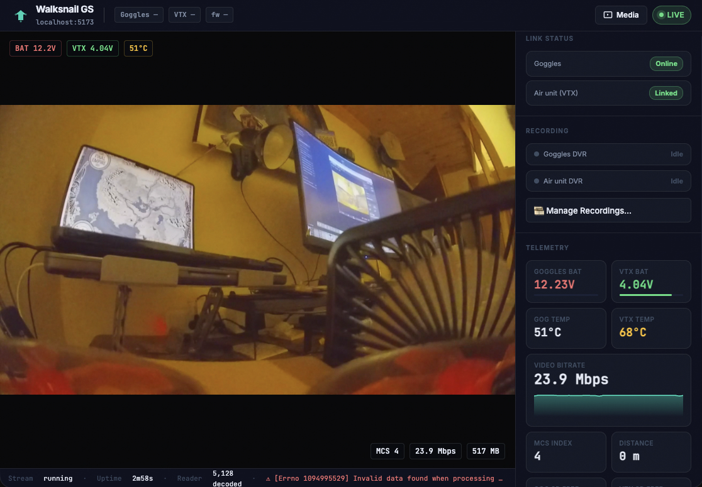
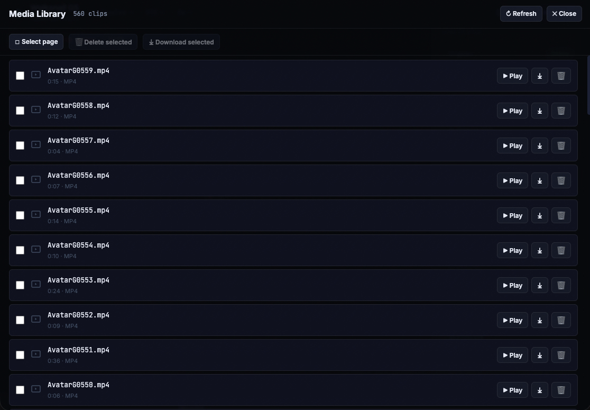

# 🚁 Walksnail Ground Station

**See your FPV feed on your computer. No app needed.**

A free, open-source desktop app for Walksnail Avatar HD goggles.  
Live video · Battery & signal telemetry · DVR recordings manager.

> Tested on **Goggles X + Avatar Mini** (firmware 39.44.15) · Not affiliated with Caddx or Walksnail

---

## What it looks like

<!-- SCREENSHOT: Dashboard with live video, OSD overlay, and telemetry sidebar -->
<!-- Replace this comment with:  -->

*Live 1080p feed with OSD — voltage, temperature, bitrate and signal quality at a glance.*

---

<!-- SCREENSHOT: DVR / recordings gallery -->
<!-- Replace this comment with:  -->

*Browse and download your DVR recordings directly from the goggles.*

---

## Download & Run

### Mac

1. Download **`WalksnailGS-mac.zip`** from [Releases](https://github.com/alejopdl/walksnail-goggles-web/releases)
2. Unzip → double-click **`WalksnailGS.app`**
3. First time only: right-click → **Open** → **Open** *(macOS security prompt)*

### Windows

1. Download **`WalksnailGS-win.zip`** from [Releases](https://github.com/alejopdl/walksnail-goggles-web/releases)
2. Unzip anywhere → double-click **`WalksnailGS.exe`**
3. First time only: click **"More info"** → **"Run anyway"** *(Windows security prompt)*

> **Why the security warning?**  
> The app isn't signed by Apple/Microsoft (that costs money). The full source code is right here for anyone to review.

---

## Before you start

Connect your computer to the **goggles' WiFi network** — not your home WiFi.

| WiFi name | Password |
|---|---|
| `Walksnail_XXXXXX` | `12345678` |

Your computer won't have internet while connected to the goggles. That's normal.

---

## How it works

1. **Power on** your goggles (drone optional — telemetry works without it)
2. **Connect** your PC to the goggles WiFi
3. **Open** the app → your browser opens automatically
4. **Fly** — the app shows live video as soon as the drone is linked

### Video quality settings

Click the ⚙️ gear icon (or press `,`) to adjust:

- **Resolution** — 1080p for best quality, 720p if the video stutters
- **Quality** — lower if your WiFi connection is weak
- **Transport** — TCP works best indoors; try UDP for lower latency outdoors

### Keyboard shortcuts

| Key | Action |
|---|---|
| `O` | Show / hide OSD overlay |
| `S` | Save a screenshot |
| `F` | Fullscreen |
| `R` | Reconnect if video drops |

---

## FAQ

**The video says "No VTX signal"**  
→ The drone or air unit isn't powered on. Turn it on and it connects automatically.

**It says "Offline"**  
→ Check that your computer is connected to the goggles WiFi, not your home WiFi.

**The video is laggy**  
→ Lower the quality in settings (gear icon). Try 720p + 60% quality.

**macOS says "unidentified developer"**  
→ Right-click the app → Open → Open. You only need to do this once.

---

## Compatibility

| Goggles | Air Unit | Firmware | Status |
|---|---|---|---|
| Goggles X | Avatar Mini | 39.44.15 | ✅ Tested |
| Other Avatar HD models | — | — | ❓ Probably works |

Tested it on a different model? [Open an issue](https://github.com/alejopdl/walksnail-goggles-web/issues) — it helps the whole community.

---

## For developers

Want to run from source or contribute? See [CONTRIBUTING.md](CONTRIBUTING.md) and [WEB_README.md](poc/python/WEB_README.md).

---

*MIT License · Not affiliated with Caddx or Walksnail*
