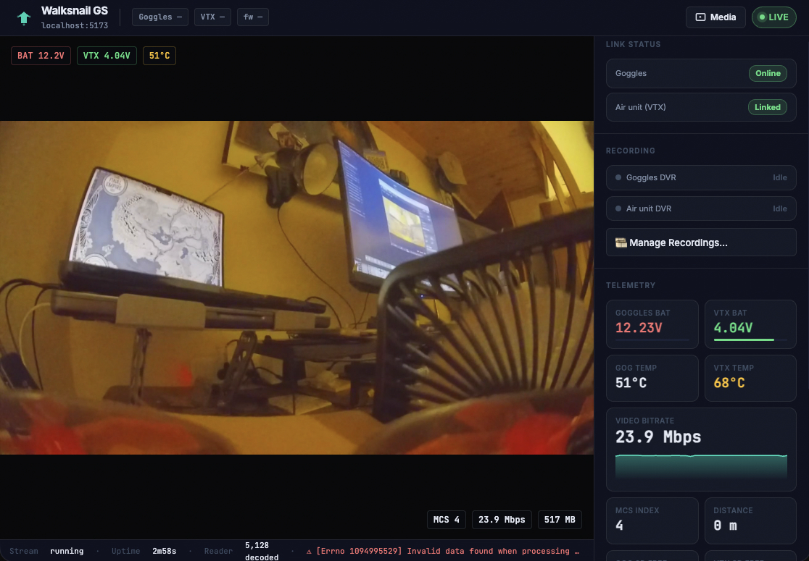
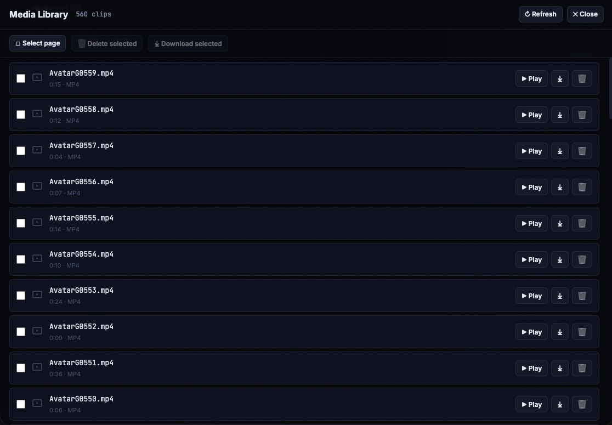

# 🚁 WS WiFi Stream

**See your FPV feed on your computer. No app needed.**

A free, open-source desktop app for Walksnail Avatar HD goggles.  
Live video · Battery & signal telemetry · DVR recordings manager.

> Tested on **Goggles X + Avatar Mini** (firmware 39.44.15) · Not affiliated with Caddx or Walksnail

---

## What it looks like

<!-- SCREENSHOT: Dashboard with live video, OSD overlay, and telemetry sidebar -->


*Live 1080p feed with OSD — voltage, temperature, bitrate and signal quality at a glance.*

---

<!-- SCREENSHOT: DVR / recordings gallery -->


*Browse and download your DVR recordings directly from the goggles.*

---

## Download & Run

Grab the latest from [Releases](https://github.com/alejopdl/walksnail-goggles-web/releases).

### Mac (Apple Silicon)

1. Download **`WS-WiFi-Stream-mac-arm64.dmg`** → open it → drag **WS WiFi Stream** to **Applications**.
2. First launch: right-click the app → **Open** → **Open** *(macOS security prompt)*.
   *(Prefer no install? The `…-mac-arm64.zip` is a portable version — unzip and run.)*

### Windows

1. Download **`WS-WiFi-Stream-win-setup.exe`** → run it *(installs for your user, no admin needed)*.
2. First launch: **More info** → **Run anyway** *(Windows security prompt)*.
   *(Prefer no install? The `…-win-amd64.zip` is a portable version — unzip and run.)*

> **Using the app:** it opens in your browser. To close it, click **Quit** in the app — or just close the browser tab and it shuts down on its own.

> **Why the security warning?**  
> The app isn't signed by Apple/Microsoft (that costs money). The full source code is right here for anyone to review.

---

## Before you start

Connect your computer to the **goggles' WiFi network** — not your home WiFi.

| WiFi name | Password |
|---|---|
| `Walksnail_XXXXXX` | `12345678` |

Your computer won't have internet while connected to the goggles. That's normal.

---

## How it works

1. **Power on** your goggles (drone optional — telemetry works without it)
2. **Connect** your PC to the goggles WiFi
3. **Open** the app → your browser opens automatically
4. **Fly** — the app shows live video as soon as the drone is linked

### Video quality settings

Click the ⚙️ gear icon (or press `,`) to adjust:

- **Resolution** — 1080p for best quality, 720p if the video stutters
- **Quality** — lower if your WiFi connection is weak
- **Transport** — TCP works best indoors; try UDP for lower latency outdoors

### Keyboard shortcuts

| Key | Action |
|---|---|
| `O` | Show / hide OSD overlay |
| `S` | Save a screenshot |
| `F` | Fullscreen |
| `R` | Reconnect if video drops |

---

## FAQ

**The video says "No VTX signal"**  
→ The drone or air unit isn't powered on. Turn it on and it connects automatically.

**It says "Offline"**  
→ Check that your computer is connected to the goggles WiFi, not your home WiFi.

**The video is laggy**  
→ Lower **JPEG Quality** (and/or **Max FPS**) in settings (gear icon). On a weak link, try **UDP** transport.

**macOS says "unidentified developer"**  
→ Right-click the app → Open → Open. You only need to do this once.

**Stream settings note**  
→ Transport / JPEG quality / max FPS tune the video sent to *your browser* (bandwidth & CPU), **not** the goggles. The real capture resolution and bitrate are set in the goggles' own menu.

---

## Known issues & troubleshooting

- **Video freezes after switching transport or applying settings, and shows "Live feed stuck — reboot the goggles".**  
  The goggles serve a **single** RTSP video session. Restarting the stream too soon can leave that session wedged. The app now waits before reconnecting and detects the stuck state — if you see that message, **power-cycle the goggles** to recover.
- **UDP looks glitchy.** UDP trades reliability for latency; on a weak Wi-Fi link you'll see artifacts. Use **TCP** for a clean image (the default).
- **The gallery takes a few seconds to load** if the goggles' SD card holds many clips (hundreds). It no longer times out, just be patient.
- **The video keeps flickering "No VTX" while the goggles boot.** Give them a few seconds to finish starting; link detection is debounced so it should settle on its own.

---

## Tested on

### Goggles / hardware

| Goggles | Air Unit | Firmware | Status |
|---|---|---|---|
| **Goggles X** | **Avatar Mini** | **39.44.15** | ✅ Fully tested |
| Other Avatar HD models | — | — | ❓ Probably works (untested) |

> This project was developed and verified specifically on **Goggles X + Avatar Mini (fw 39.44.15)**. Other Avatar HD hardware likely works because it shares the same protocol, but it hasn't been confirmed.

### Operating systems

| Platform | Status |
|---|---|
| **macOS (Apple Silicon)** | ✅ Tested |
| **Windows** | 🟡 Build provided — community testing welcome |
| macOS (Intel) | ❓ Untested |
| Linux / any OS (from source) | 🟡 Runs from source (Python) |

### Mobile app

| Platform | Status |
|---|---|
| **Android** | ✅ Available — download the APK from [Releases](https://github.com/alejopdl/walksnail-goggles-web/releases) |
| **iOS** | 🚧 In progress |

Tested on a different goggles model or OS? [Open an issue](https://github.com/alejopdl/walksnail-goggles-web/issues) — it helps the whole community.

---

## Debug mode

Hit a connection/reconnection problem worth reporting? Run the app with a session log:

```bash
# macOS (installed app), from Terminal:
"/Applications/WS WiFi Stream.app/Contents/MacOS/WS-WiFi-Stream" --debug
# Windows: run WS-WiFi-Stream.exe --debug  from a terminal
```

It writes a timestamped log (also shown in the terminal) capturing every request to
the goggles (timing/result), the RTSP reconnection lifecycle, VTX link transitions,
and a request-rate summary — handy for diagnosing reconnection or gallery issues.
Add `--debug-verbose` to also log full request/response bodies.

Log location:
- **macOS:** `~/Library/Logs/WS-WiFi-Stream/session-*.log`
- **Windows:** `%LOCALAPPDATA%\WS-WiFi-Stream\logs\session-*.log`

---

## For developers

Want to run from source or contribute? See [WEB_README.md](poc/python/WEB_README.md).

---

*MIT License · Not affiliated with Caddx or Walksnail*
