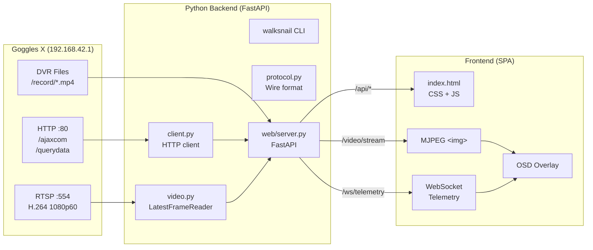

# Walksnail Ground Station — Documentación del Proyecto Web

## Visión General

Ground Station web para las gafas **Walksnail Avatar HD Goggles X** (Caddx). Provee video en vivo, telemetría y control desde cualquier navegador — sin instalar apps nativas.

> [!IMPORTANT]
> Todo el protocolo fue reverse-engineered por observación del tráfico HTTP/RTSP. No se usó código descompilado.

---

## Arquitectura



---

## Estructura de Archivos

```
poc/python/
├── pyproject.toml                    # Package config, deps, entry points
├── walksnail_client/
│   ├── __init__.py
│   ├── protocol.py                   # Wire format (pure, sin I/O)
│   ├── client.py                     # HTTP control client (stdlib only)
│   ├── video.py                      # RTSP decode + LatestFrameReader
│   ├── cli.py                        # CLI: walksnail <command>
│   └── web/
│       ├── __init__.py
│       ├── server.py                 # FastAPI backend
│       └── static/
│           └── index.html            # SPA frontend (HTML + CSS + JS)
└── tests/
    ├── test_protocol.py              # unit tests (protocolo)
    └── test_web.py                   # unit tests (web, todo mockeado)
```

---

## Módulos

### 1. `protocol.py` — Wire Format
[protocol.py](file:///Users/pdl/Projects/Caddx%20APP/poc/python/walksnail_client/protocol.py)

Capa pura (sin I/O). Define el formato del protocolo HTTP de las gafas.

**Protocolo wire:**
- `POST /ajaxcom` → comandos `SysQuery` / `SysCtrl` (body: `szCmd=<JSON>`)
- `POST /querydata` → DVR records (`query_record`)
- Respuesta: `{"nRetVal": 0, "stValue": {...}}` (0 = OK)

**Comandos definidos:**

| Constante | Tipo | Descripción |
|---|---|---|
| `CMD_VERSION` | SysQuery | Seriales, HW/SW de gafas y VTX |
| `CMD_ONLINE` | SysQuery | Ping (online=1) |
| `CMD_DEVICE_STATE` | SysQuery | Telemetría completa |
| `CMD_REBOOT` | SysCtrl | Reiniciar gafas |
| `CMD_UPDATE_REBOOT` | SysCtrl | Aplicar firmware + reiniciar |
| `CMD_FACTORY_DEFAULT` | SysCtrl | Reset de fábrica |
| `CMD_FORMAT_GOGGLES_SD` | SysCtrl | Formatear SD de gafas |
| `CMD_FORMAT_VTX_SD` | SysCtrl | Formatear SD del VTX |

**Funciones:**

| Función | Descripción |
|---|---|
| `szcmd(obj)` | Codifica dict → `szCmd=<JSON compacto>` |
| `sys_query(name, arg)` | Builder para `{"SysQuery": {...}}` |
| `sys_ctrl(name, arg)` | Builder para `{"SysCtrl": {...}}` |
| `cmd_set_time(when)` | Sincronizar reloj de las gafas |
| `cmd_delete_record(filename)` | Borrar clip DVR |
| `cmd_query_record(start, limit)` | Listar grabaciones |
| `rtsp_url(host)` | `rtsp://<host>/live.ch01` |
| `record_url(filename, host)` | URL de descarga de clip |
| `parse_response(raw)` | Parsear JSON, raise `GogglesError` si falla |

---

### 2. `client.py` — HTTP Control Client
[client.py](file:///Users/pdl/Projects/Caddx%20APP/poc/python/walksnail_client/client.py)

Cliente HTTP sincrónico. **Solo usa stdlib** (urllib) — cero dependencias.

**Clase `WalksnailClient(host, timeout)`:**

| Método | Retorna | Descripción |
|---|---|---|
| `online()` | `bool` | Ping las gafas |
| `get_version()` | `DeviceInfo` | Seriales, firmware, HW |
| `get_device_state()` | `dict` | Telemetría completa (voltaje, temp, bitrate, etc.) |
| `vtx_connected()` | `bool` | ¿Hay drone vinculado? |
| `set_time(when)` | `None` | Sincronizar reloj |
| `reboot()` | `None` | Reiniciar gafas ⚠️ |
| `factory_reset()` | `None` | Reset de fábrica ⚠️ |
| `format_goggles_sd()` | `None` | Formatear SD gafas ⚠️ |
| `format_vtx_sd()` | `None` | Formatear SD VTX ⚠️ |
| `list_records(start, limit)` | `dict` | Lista clips DVR |
| `download_record(filename, dest)` | `str` | Descarga un clip |
| `delete_record(filename)` | `None` | Borrar clip ⚠️ |

**Dataclass `DeviceInfo`:**
- `goggles_sn`, `goggles_hw`, `goggles_sw`
- `tx_sn`, `tx_hw`, `tx_sw`
- `vtx_present` (property: True si el serial del VTX no es `"--------"`)

---

### 3. `video.py` — RTSP Decode & Display
[video.py](file:///Users/pdl/Projects/Caddx%20APP/poc/python/walksnail_client/video.py)

Decodifica el stream H.264 de las gafas vía RTSP usando PyAV (FFmpeg).

**Clase `LatestFrameReader(host, transport)`:**

El corazón del video en vivo. Decodifica en un thread de background y expone **solo el frame más reciente** para latencia mínima.

| Atributo / Método | Tipo | Descripción |
|---|---|---|
| `start()` | `self` | Inicia el thread de decodificación |
| `read()` | `ndarray \| None` | Último frame (o None si aún no hay) |
| `stop()` | `None` | Para el thread |
| `frames_decoded` | `int` | Contador de frames decodificados |
| `last_error` | `Exception \| None` | Último error (para diagnóstico) |
| `transport` | `str` | `"tcp"` o `"udp"` |

**Características de resiliencia:**
- **Auto-reconnect:** si el stream se corta, vuelve a conectar automáticamente
- **Skip corrupt:** frames corruptos (pérdida de paquetes UDP) se omiten
- **Slice threading:** decodificación paralela sin buffering (latencia mínima)
- **Low-latency FFmpeg opts:** `nobuffer`, `low_delay`, `max_delay=0`

**Otras funciones:**

| Función | Descripción |
|---|---|
| `live_frames(host, bgr, transport)` | Generador simple de frames (sin reconnect) |
| `show_live(host, transport, osd)` | Abre ventana cv2 con el feed en vivo |
| `play_url(url)` | Reproduce un clip DVR a velocidad real |

---

### 4. `web/server.py` — FastAPI Backend
[server.py](file:///Users/pdl/Projects/Caddx%20APP/poc/python/walksnail_client/web/server.py)

Servidor web que conecta todo: video MJPEG, telemetría WebSocket, API REST.

**Rutas API:**

| Método | Ruta | Descripción |
|---|---|---|
| `GET` | `/video/stream` | Stream MJPEG (`multipart/x-mixed-replace`) |
| `GET` | `/api/stream/status` | Health del reader (frames, uptime, error) |
| `POST` | `/api/stream/restart` | Reiniciar reader RTSP |
| `GET` | `/api/online` | Ping gafas → `{online: bool}` |
| `GET` | `/api/info` | Seriales, firmware, HW |
| `GET` | `/api/state` | Telemetría completa |
| `POST` | `/api/settime` | Sincronizar reloj |
| `GET` | `/api/records` | Listar clips DVR |
| `DELETE` | `/api/records/{filename}` | Borrar clip |
| `GET` | `/api/records/{filename}/download` | Descargar clip (proxy) |
| `WS` | `/ws/telemetry` | Push de telemetría cada 500ms |
| `GET` | `/` | SPA frontend (static) |

**Parámetros del stream MJPEG (`/video/stream`):**

| Param | Default | Rango | Descripción |
|---|---|---|---|
| `transport` | `tcp` | tcp, udp | Transporte RTSP |
| `quality` | `82` | 10–95 | Calidad JPEG (%) |
| `scale` | `1.0` | 0.2–1.0 | Factor de escala (1.0=1080p) |
| `fps` | `30` | 1–60 | FPS máximo |

**Placeholder inteligente:** Cuando no hay frame (sin VTX, conectando, error), genera una imagen oscura con dot-grid y mensaje contextual. Usa cache para evitar re-renderizar.

**CLI entry point `walksnail-web`:**

```
walksnail-web [--host HOST] [--port PORT] [--bind BIND]

  --host   IP de las gafas (default: 192.168.42.1)
  --port   Puerto del web server (default: 8080)
  --bind   Dirección de bind (default: 0.0.0.0)
```

---

### 5. `web/static/index.html` — Frontend SPA
[index.html](file:///Users/pdl/Projects/Caddx%20APP/poc/python/walksnail_client/web/static/index.html)

Aplicación single-page con diseño dark premium. ~1160 líneas (HTML + CSS + JS en un solo archivo).

**Layout:**
- **Header:** Logo, nombre, host, chips de goggles/VTX/firmware, badge de conexión
- **Video (centro-izquierda):** Stream MJPEG via ``, OSD overlay, barra de controles
- **Sidebar (derecha):** Link status, telemetría cards con sparkline, device info, controles
- **Status bar (abajo):** Estado del stream, uptime, frames decodificados, errores

**Sistema de estados del video:**

| Estado | Badge | Overlay | Cuándo |
|---|---|---|---|
| `connecting` | 🟡 Connecting | Spinner + "Connecting…" | Iniciando stream RTSP |
| `live` | 🟢 LIVE | (ninguno — video visible) | Frames llegando |
| `no-vtx` | 🟣 No VTX | Icono drone tachado | Gafas online pero sin drone |
| `error` | 🔴 Error | Mensaje + botón Retry | Fallo de red |
| `offline` | ⚫ Offline | WiFi tachado + botón Retry | Gafas no accesibles |

**OSD Overlay (tecla `O`):**
- Arriba izq: Voltaje gafas (coloreado), voltaje VTX, temperatura
- Abajo izq: Indicadores `● REC GND` / `● REC VTX` (parpadean)
- Abajo der: MCS index, bitrate en Mbps, espacio SD

**Settings Drawer (tecla `,`):**
- Transport: TCP / UDP
- Resolución: 1080p / 720p / 540p / 360p
- Calidad JPEG: slider 20%–95%
- FPS máximo: 15 / 30 / 60
- Botón "Apply & Restart Stream"

**Atajos de teclado:**

| Tecla | Acción |
|---|---|
| `O` | Toggle OSD |
| `S` | Captura de pantalla (descarga JPG) |
| `F` | Pantalla completa |
| `,` | Toggle settings drawer |
| `R` | Reintentar stream |

**Auto-recuperación de errores:**
- Exponential backoff en `onerror` del `` (600ms → 12s cap)
- Stale-frame detector (cada 5s, compara `frames_decoded`)
- WebSocket reconnect automático cada 3s
- Botón "Retry Now" para recuperación manual

**Telemetría en tiempo real:**
- Cards con valores numéricos + barras de progreso coloreadas
- Sparkline de bitrate (canvas, últimas 40 muestras)
- Colores adaptivos: verde (OK) → amarillo (warning) → rojo (critical)
- Umbrales de voltaje: gafas 21V–25.2V, VTX 3.3V–4.2V
- Umbrales de temperatura: >55°C amarillo, >70°C rojo

**Design System (CSS tokens):**
- Fuentes: Inter (UI), JetBrains Mono (datos)
- Paleta dark: `--bg: #080b12`, `--accent: #00e5c3`
- Glassmorphism: backdrop-filter en OSD chips
- Micro-animaciones: pulse en badges, blink en REC, spin en spinner

---

### 6. `cli.py` — CLI
[cli.py](file:///Users/pdl/Projects/Caddx%20APP/poc/python/walksnail_client/cli.py)

CLI completo: `walksnail <command> [options]`

| Comando | Descripción |
|---|---|
| `info` | Versiones, seriales, HW |
| `state` | Telemetría en JSON |
| `records` | Listar clips DVR |
| `download <file> [dest]` | Descargar un clip |
| `play <file>` | Reproducir clip en ventana cv2 |
| `pull-all [dest]` | Descargar todos los clips |
| `delete <file> --yes` | Borrar clip (requiere `--yes`) |
| `settime` | Sincronizar reloj |
| `reboot --yes` | Reiniciar gafas (requiere `--yes`) |
| `factory-reset --yes` | Reset de fábrica (requiere `--yes`) |
| `format goggles\|vtx --yes` | Formatear SD (requiere `--yes`) |
| `live [--udp] [--osd]` | Video en vivo en ventana cv2 |

---

## Tests (sin hardware)

```bash
python -m pytest tests/ -q     # 46 tests, ~0.4s
```

| Suite | Qué cubre |
|---|---|
| `tests/test_protocol.py` | Encoding szCmd, parsing JSON, error handling |
| `tests/test_web.py` | Endpoints REST, WebSocket, MJPEG gen, placeholders, static serving, media library |

---

## Instalación

```bash
cd poc/python

# Crear virtualenv
python3 -m venv .venv && source .venv/bin/activate

# Solo CLI (sin video, sin dependencias extra)
pip install -e .

# Con video en ventana nativa
pip install -e ".[video]"

# Con web ground station (lo que necesitás)
pip install -e ".[web]"
```

---

## Uso

### Modo directo (PC conectada al WiFi de las gafas)

```bash
walksnail-web
# Abrir http://localhost:8080
```

> [!NOTE]
> **Sesión única:** las gafas sirven el RTSP en vivo a **un solo cliente** a la
> vez. Cerrá la vista en vivo de la app del teléfono (y cualquier `ffplay`) antes
> de conectar, o no vas a ver video. Para usar el cliente con la PC apuntando a un
> host distinto (p.ej. a través de un reenvío de puertos propio), pasá
> `--host <ip:puerto>` y, si el RTSP va por otro puerto, `--rtsp-host <ip:puerto>`.

### Solo localhost (evita prompt del firewall macOS)

```bash
walksnail-web --bind 127.0.0.1 --port 5080
# Abrir http://localhost:5080
```

---

## Telemetría — Campos del `devicestate`

| Campo | Tipo | Descripción |
|---|---|---|
| `vtx_connect` | int | 1 = drone vinculado, 0 = sin link |
| `gas_voltage` | float | Voltaje batería gafas (6S ~22–25V) |
| `vtx_voltage` | float | Voltaje batería VTX (~3.3–4.2V) |
| `gas_tempeture` | int | Temperatura gafas (°C) |
| `vtx_tempeture` | int | Temperatura VTX (°C) |
| `bitrate` | int | Bitrate video (bps, ej: 24206560) |
| `u8_mcs` | int | MCS index (0–9, calidad RF) |
| `distance` | int | Distancia estimada (metros) |
| `gas_sd_space` | int | Espacio libre SD gafas (MB) |
| `vtx_sd_space` | int | Espacio libre SD VTX (MB) |
| `gas_rec_state` | int | 1 = grabando en gafas |
| `vtx_rec_state` | int | 1 = grabando en VTX |
| `gas_type` | int | Tipo de gafas (3 = Goggles X) |
